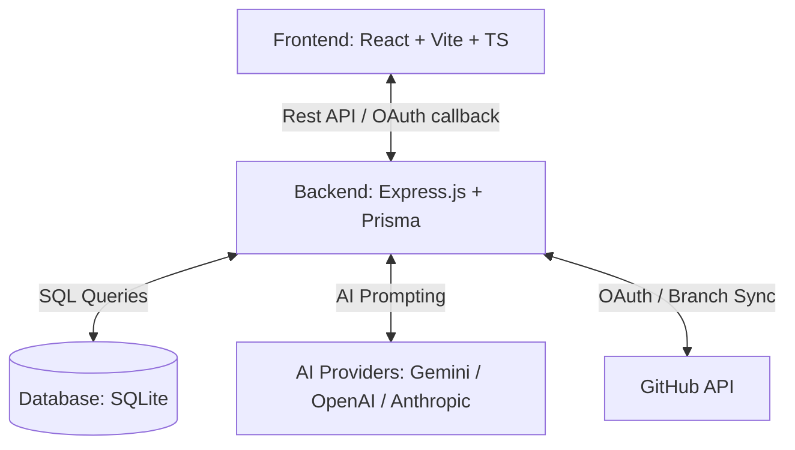

<div align="center">
  
  <h1>Developer Productivity Tools</h1>
</div>

*DevSync** es una suite unificada de herramientas avanzadas diseñadas para maximizar la productividad y acelerar el ciclo de vida del desarrollo de software. Desarrollada por el equipo **Troyanos vibe coders**, la suite integra diseño visual, inteligencia artificial, monitoreo en tiempo real de Git y análisis de código estático dentro de un entorno sincronizado.

---

## 🌟 Módulos y Herramientas principales

### 1. 📐 Database Designer (Blueprint)
Un canvas interactivo donde puedes diseñar tus bases de datos de forma visual.
- **Drag & Drop**: Crea tablas, columnas y añade claves primarias o foráneas de manera visual.
- **Relaciones Visuales**: Dibuja conectores entre tablas para definir llaves foráneas instantáneamente.
- **Multi-Motor**: Exporta esquemas optimizados para **PostgreSQL**, **MySQL**, **SQLite**, **MongoDB (Mongoose)** y **Prisma ORM**.
- **Vista Split**: Edita mediante código abreviado shorthand y ve el diseño actualizarse en tiempo real.

### 2. 👥 StackAgent (Bandwidth)
Distribuidor inteligente de tareas potenciado con IA para equipos de desarrollo.
- **Prevención de Burnout**: Analiza la carga horaria estimada y la complejidad para distribuir de forma equitativa.
- **Sugerencias Inteligentes**: Asigna tareas automáticamente basándose en las habilidades y disponibilidad de cada miembro del equipo.

### 3. 🌿 MergeGuard & BranchTree (Visual Branch Synchronizer)
Un mapa bioluminiscente neuronal que representa las ramas del repositorio.
- **Monitoreo en Tiempo Real**: Conexión directa a la API de GitHub para recuperar ramas y colaboradores reales.
- **Detector de Conflictos**: Identifica y notifica preventivamente posibles conflictos de merge antes de que ocurran en el servidor.
- **Salud de Sincronización**: Visualiza commits rezagados de la rama principal (`main`/`master`).

### 4. 🔍 DeepLint (AI-Powered Code Review)
Un motor de análisis estático inteligente alimentado por agentes de IA.
- **Detección Avanzada**: Busca vulnerabilidades de seguridad, malas prácticas y fallos de rendimiento.
- **Auto-Parcheado**: Genera diffs corregidos que puedes copiar y aplicar directamente a tu base de código.

### 5. 📝 Docify (Rapid Documentation Generator)
Genera la documentación del proyecto de forma automatizada.
- **Escaneo Inteligente**: Lee archivos `.ts`, `.tsx`, `.js`, `.jsx`, `.css` y compone un archivo `README.md` estructurado explicando el rol de cada módulo y componente del software.

---

## 🏗️ Arquitectura y Tecnologías

El proyecto se estructura como un monorepo dividido en dos componentes principales:



---

## ⚙️ Configuración del Entorno (`.env`)

Para ejecutar la aplicación localmente, copia y configura las variables de entorno en los directorios correspondientes.

### Frontend (`/front-end/.env`)
```env
VITE_API_URL=http://localhost:3000
VITE_GEMINI_API_KEY=tu_api_key_de_gemini
VITE_GITHUB_CLIENT_ID=tu_github_client_id_de_oauth_app
VITE_GOOGLE_CLIENT_ID=tu_google_client_id_de_oauth_credential
```

### Backend (`/back-end/.env`)
```env
PORT=3000
DATABASE_URL="file:./dev.db"

# GitHub API & OAuth
GITHUB_ACCESS_TOKEN=tu_personal_access_token_de_github
GITHUB_CLIENT_ID=tu_github_client_id
GITHUB_CLIENT_SECRET=tu_github_client_secret

# Google OAuth
GOOGLE_CLIENT_ID=tu_google_client_id
GOOGLE_CLIENT_SECRET=tu_google_client_secret

# AI Models Keys
OPENAI_API_KEY=tu_openai_key
ANTHROPIC_API_KEY=tu_anthropic_key

# AWS S3 Storage Config (Opcional)
AWS_REGION=us-east-2
AWS_ACCESS_KEY_ID=tu_aws_key_id
AWS_SECRET_ACCESS_KEY=tu_aws_secret
AWS_S3_BUCKET=tu_s3_bucket_name
```

---

## 🚀 Instalación y Despliegue Local

### Opción A: Mediante Docker Compose (Recomendado)
Docker empaquetará tanto el backend como el frontend de forma sincronizada:

```bash
# Iniciar servicios
docker-compose up --build
```
La aplicación estará disponible en `http://localhost`.

### Opción B: Ejecución Manual en Desarrollo

#### 1. Servidor Backend
```bash
cd back-end
npm install
npm run db:migrate   # Ejecuta las migraciones de SQLite con Prisma
npm run seed         # Población inicial de base de datos
npm run dev          # Inicia servidor Express en puerto 3000
```

#### 2. Servidor Frontend
```bash
cd front-end
npm install
npm run dev          # Inicia servidor Vite en puerto 5173
```

---

## 👥 Equipo de Desarrollo (Troyanos vibe coders)

- **Full-Stack:** Fernando
- **Front-End:** Andres y Axel
- **Back-End:** Alan y Alex
